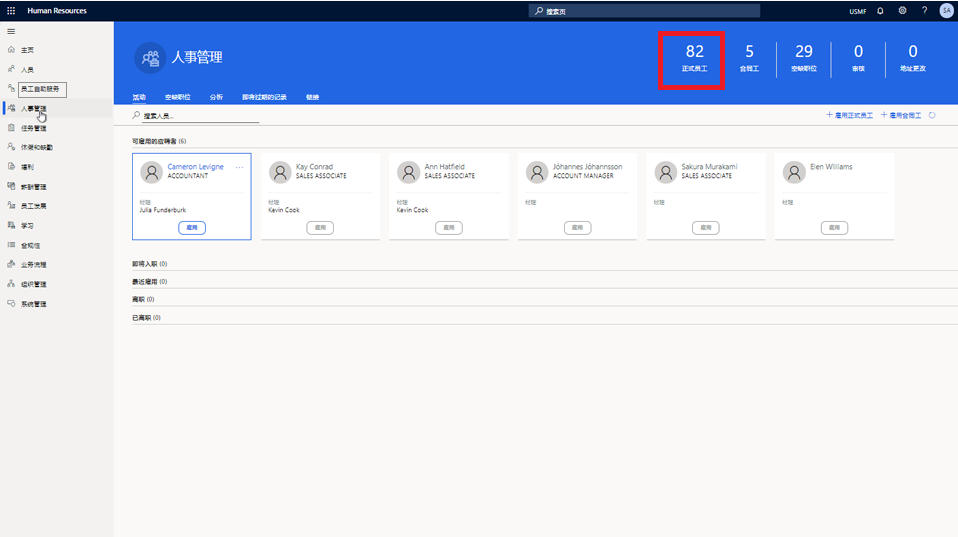

---
demo:
  title: 演示 1：分配学习课程
  module: 'Module 4: Learn the Fundamentals of Microsoft Dynamics 365 Human Resources'
---

## 演示 1 - 分配学习课程

1. 浏览到“Microsoft Dynamics 365 Human Resources”主页。  
    在 Microsoft Dynamics 365 Human Resources 中，人事经理可以为员工分配培训课程。 在本例中，需要向公司的新雇员 Alicia 分配员工在前 30 天内可使用的培训。

1. 在右上方的公司选择器中，验证你要连接的公司是否是“USMF”。 如果不是，请将其更改为“USMF”。

1. 在屏幕左上角，选择“人员管理”选项卡。

1. 在“人员管理”页面的右侧，单击“员工”一词正上方的数字 。

    

1. 在“员工”表中，选择要向其分配培训的员工的姓名。 例如“Alicia Thornber”。  
    然后，使用“能力和发展”选项卡查看指向有关员工证书、教育和技能的信息的链接。

1. 在“员工”页面上，选择“能力和发展”选项卡。

1. 在“能力”部分中，选择“课程” 。  
    在员工的“课程”页面中，可以查看是否分配了任何课程。 Alicia 示例中未列出任何课程。 要查看可以分配的课程，需要选择“课程 ID”菜单。

1. 选择“课程 ID”菜单。

1. 在“课程”表中，选择“课程 ID”菜单。

1. 在“课程 ID”菜单中，选择“课程状态”菜单 。

1. 在“课程状态”菜单中，选中“课程状态为”框 。  
    然后，你可能需要编辑要应用的“课程 ID”筛选器，例如将筛选器更改为仅显示公开课程。

1. 在“课程状态为”框中，输入“公开” 。

1. 在“课程状态”菜单中，选择“应用”以查看所有可用的公开课程 。  
    现在，你可以向 Alicia 分配新员工培训课程。

1. 选择想要分配的课程。 例如“00006 新员工培训”。

1. 在“转移课程数据”窗格中，选择“是”。

1. 在“课程”页面的“开始日期”列中，选择日历图标  。

1. 在日历中，选择开始日期。 例如，2021 年 1 月 5 日。

1. 在“结束日期”列中，选择日历图标 。

1. 在日历中，选择培训的结束日期。 例如，2021 年 1 月 8 日。

1. 在“课程”页面的左侧，选择“保存”以保存更改 。

1. 在“课程”页面的右侧，选择“X”关闭页面 。  
    如果需要更改任何已分配的课程，请再次选择“课程”。

1. 在“员工”页面的“能力”部分中，选择“课程”  。

1. 在“课程”页面的导航栏中，选择“编辑”进行更改 。

1. 在“开始日期”列中，选择日历图标 。

1. 为课程选择新的开始日期。 例如，2021 年 1 月 6 日。

1. 选择“保存”  。

1. 选择“X”图标关闭页面。

1. 在“员工”页面上，选择“X”图标关闭页面 。
