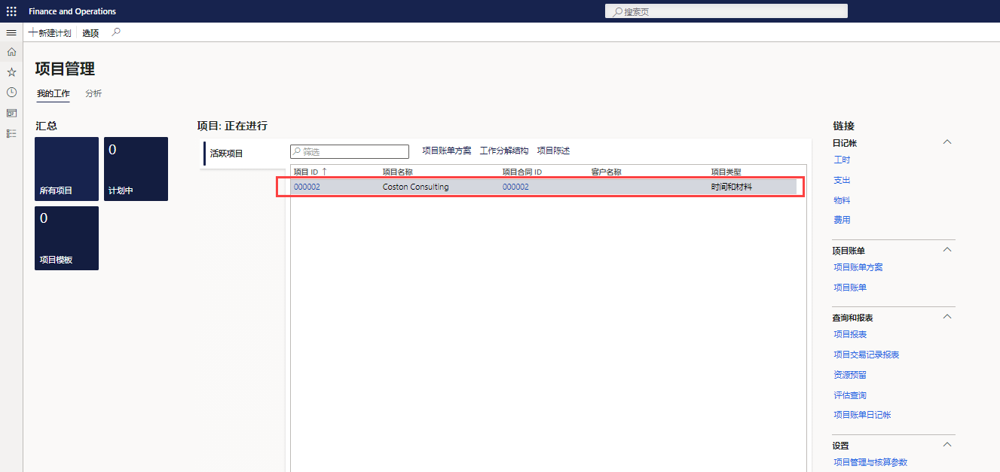
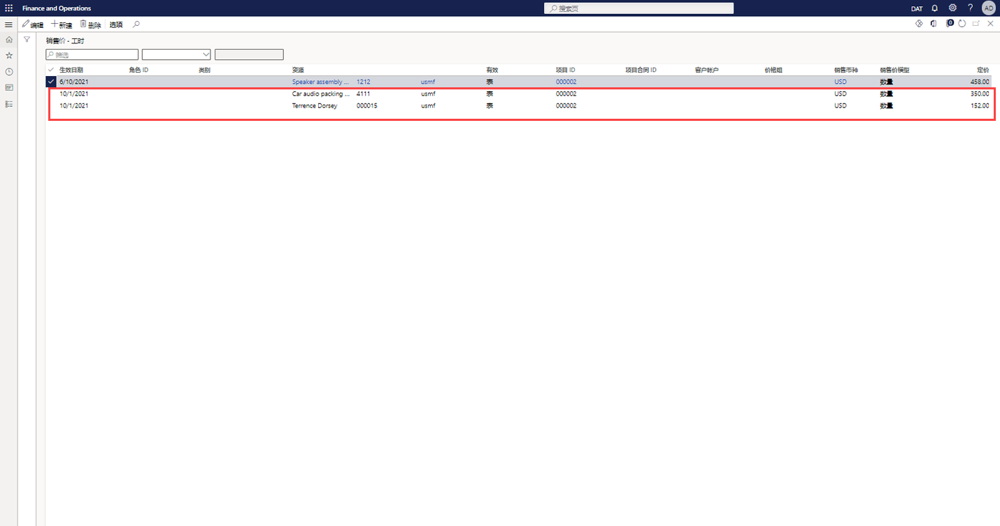
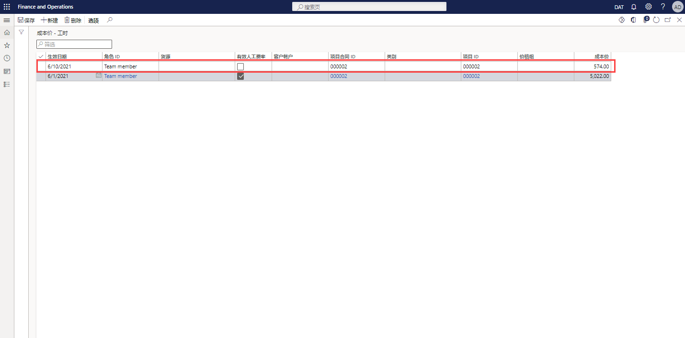

---
demo:
  title: 演示 1：Project Operations 定价
  module: 'Module 5: Learn the Fundamentals of Microsoft Dynamics 365 Project Operations'
---

## 演示 1 - Project Operations 定价

1. 浏览到“项目管理”工作区。  
    在本演示中，我们将在 Project Operations 中设置销售价和成本价。 我们将了解如何从先前过帐的发票中得出成本和价格。

1. 在右上方的公司选择器中，验证你连接的法人是否是“USSI”。  
    如果不是，请将该组织更改为“USSI”。

1. 在“启用项目”表中，选择项目“00000093 Contoso Consulting” 。 这将打开项目详细信息视图。

    

1. 在“Contoso Consulting”页面的导航栏中，选择“管理”选项卡 。

1. 在“管理”菜单中，选择“发票日记帐” 。  
    我们在此处找到一张应用了工时的发票。

1. 在“发票交易记录”下的“销售价”列中，指向“350.00”  。  
    我们可以在此视图中看到，资源 Aaron Con（USSI 的项目经理）的销售价为 350 美元。 让我们查看一下定价设置，看看此价格是如何确定的。

      

    虽然我们可以查看单个项目的价格，但我们将从“项目管理”工作区开始，以便能够看到所有定价设置。

1. 浏览到“项目管理”工作区。

1. 在屏幕右侧的“链接”部分的“设置”子菜单中，选择“销售价(工时)”  。

1. 在“销售价 - 工时”页面，在表的“定价”列中，指向“350.00”  。  
在此视图中，我们可以看到 Aaron Con 的销售价设置为 350 美元。

1. 指向整个第一行。  
    如果我们查看整个行，便可以看到，Aaron 被设置为项目经理，更具体地说，价格与 Contoso Consulting 的特定项目 ID 相关联。

1. 在“资源”列中，指向已分配有资源的所有其他行。  
    我们可以在此表中看到还设置了其他项目经理，但他们没有被专门分配给项目 ID，因此他们的价格仅针对已分配的类别和资源。

      

    该矩阵足够灵活，可以支持我们看到的 Contoso Consulting 和 Aaron Con 的详细程度，并且支持更通用的定价模型，例如此处所示的 300 美元价格。

1. 对于 Contoso 项目，导航到“发票日记帐”页面。  
    返回已过帐的发票，我们将查看相同的已过帐工时交易记录，并通过选择发票交易记录行上的交易记录 ID 来查看与 Aaron Con 相关的成本。

1. 在“发票交易记录”部分，选择“工时”选项卡 。在出现的表中的“交易记录 ID”列中，选择一个交易记录 ID。

    

1. 在“工时交易记录”页面，选择“概述”选项卡 。在出现的表中的“成本价”列中，指向“200.00” 。  
    在工时交易记录视图中，我们可以看到 Aaron Con 的条目，并且可以看到相关成本价为 200 美元。 让我们返回并查看成本价设置，看看是如何得出该成本率的。

1. 浏览到“项目管理”工作区。

1. 在屏幕右侧的“链接”部分的“设置”子菜单中，选择“成本价(工时)”  。

1. 在“成本价 - 工时”标准视图页的表中，指向“生效日期”列包含“2014/1/1”、“类别”列包含“PM”、“成本价”列包含“200.00”且其他列不包含任何值的行      。  
    在此视图中，可以看到专为 PM 类别设置的 200 美元成本价，但不存在针对 Aaron 或我们的 Contoso Consulting 项目的其他行。 这也是一种常见做法，因为许多服务组织都会跨类别应用标准成本率，在本例中，这里将其识别为项目角色。 此成本通常是一种混合费率，其中，单个资源支付率将仅存储在工资单或 HR 系统中。 随着工资成本分析的进行，将定期调整标准成本率，以确保其准确无误，并满足利润要求。

    

1. 浏览到“项目管理”工作区。

1. 在屏幕右侧的“链接”部分的“设置”子菜单中，指向“成本价(工时)”和“销售价(工时)”   。  

在本演示中，我们探索了如何在 Project Operations 中设置标准销售价和成本价。 我们查看了它们对已过帐发票的影响，以便了解这些价格的设置如何直接影响提供的时间和材料发票。
