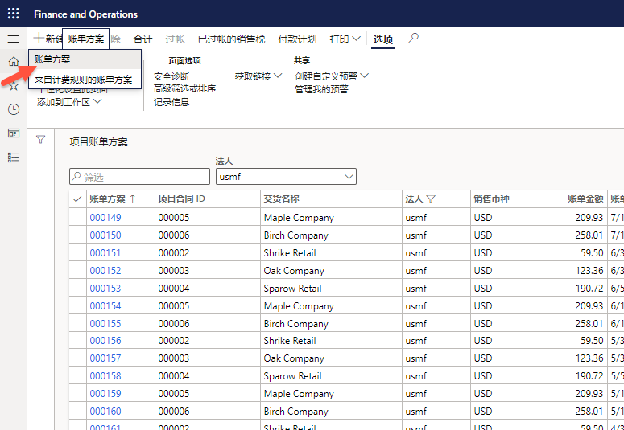
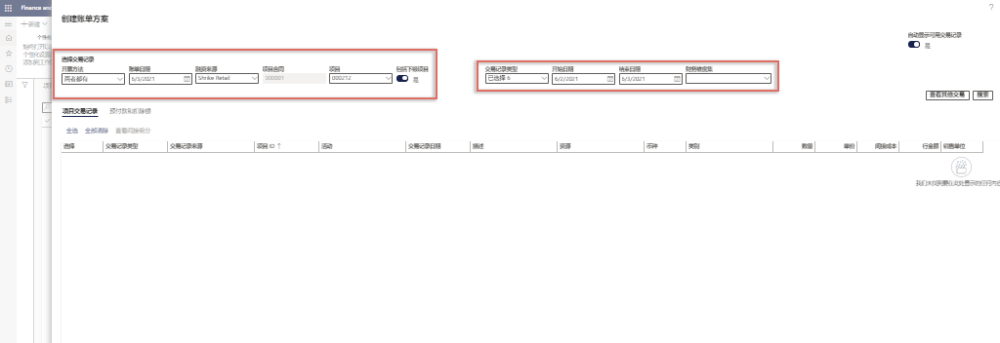
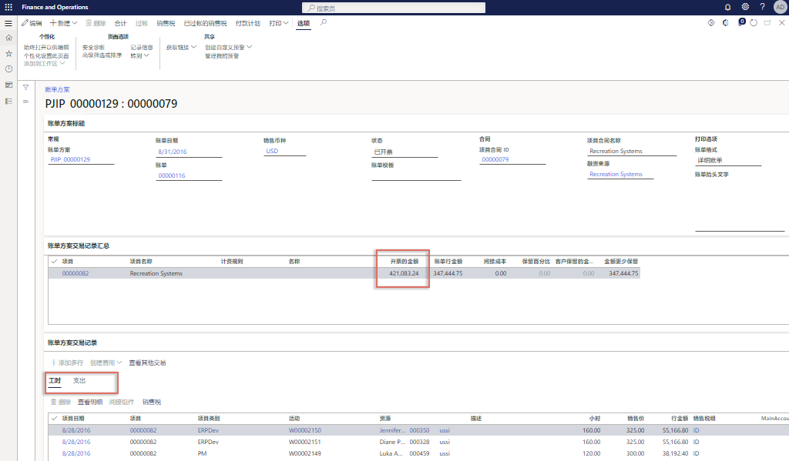

---
demo:
  title: 演示 2：创建发票
  module: 'Module 5: Learn the Fundamentals of Microsoft Dynamics 365 Project Operations'
---

## 演示 2 - 创建发票

1. 浏览到“项目管理”工作区 **** 。  
    In this demo, we'll go over the process of invoicing a single project within project operations. Although it's possible to perform mass invoicing, for demonstration purposes we will focus on just a single time and material project. We'll also see the posting results and financial insights within the project statement. Let's start with project invoicing. 

1. In the top-right company picker, verify the legal entity you are connected to is<bpt id="p1"> **</bpt>USSI<ept id="p1">**</ept>. If it's not, change the legal entity to<bpt id="p1"> **</bpt>USSI<ept id="p1">**</ept>.  
    From the<bpt id="p1"> **</bpt>Project management<ept id="p1">**</ept> workspace, we can see all the active projects. We can search for projects using the filter, or in this example, we will select a known Project ID. 

1. 在“启用项目”表的“项目 ID”列中，选择“00000093 Contoso Consulting” ****   ****   **** 。  

1. 接下来，打开“项目发票方案”页面，查看为 Contoso Consulting 处理的所有先前发票 ****  。 

1. 在操作窗格的“帐单”选项卡中，选择“项目发票方案” ****   **** 。 

1. 在“项目发票方案”页面上的导航栏中，选择“新建”，然后选择“发票方案” ****   ****  **** 。  
    这是一张简单的时间和材料发票，因此我们无需从计费规则中选择“发票方案”选项。 

    

1. 在“创建发票方案”窗格中，指向“选择交易记录”下方的框 ****   **** 。  
    From here, we can select things such as the invoicing method, the invoice date, the funding source, and the project. We can also choose to include sub projects, as well as incorporate transaction types, the start and end dates for transactions, and any financial dimensions we need. 

    

1. 在“项目”下拉菜单中，选择“00000093 Contoso Consulting” ****   **** 。 

1. 对于此示例，请确保“发票日期”设置为“2021/2/1”，“开始日期”设置为“2021/2/1”，并且结束日期为今天的日期 ****  ****  ****   **** 。  
    选择后，选择“搜索”按钮即可查找符合这些参数的交易记录。

1. 选择“搜索” **** 。  
    在本演示中，我们将探讨在 Project Operations 中为单个项目开具发票的过程。

1. 在“项目交易记录”选项卡下，选择“全选” ****   **** 。

1. 选择“确定”。 **** 

1. 在“发票方案”页面，指向“发票行金额”列 ****   ****  。  
    我们可以在此处看到发票金额和摘要、工时交易记录以及费用。

    

1. 指向“工时”选项卡 ****  。 

1. 指向“费用”选项卡 **** 。  
    还可以切换到支出交易记录并进行查看。  
接下来，让我们选中“总计”按钮，看看从成本和收入角度来看发票是什么样的。

1. 在导航栏中，选择“总计” **** 。

1. 在“总计”页面，指向“总帐”列、“客户”列和“行折扣”列 ****  ****  ****   **** 。  
    在“总计”屏幕上，我们可以看到对总帐、信用额度等任何客户信息、任何折扣和销售税的影响，以及发票的净影响。 

1. 在屏幕右侧，选择“X”关闭页面 ****  。  
    虽然可以大规模开具发票，但出于演示目的，我们将仅重点介绍单个时间和材料项目。 

1. 在“发票方案”页面上的导航栏中，选择“打印预览” ****   **** 。 

1. 在对话框中，选择“打印预览” **** 。  
    可在此处看到形式发票的打印预览示例。 

1. 选择“X”关闭页面 。  
    验证了所有信息，并且对发票的打印预览感到满意之后，便可以过帐发票方案。

1. 在导航栏中，选择“过帐” **** 。

1. 选择“参数”选项卡 ****  。

1. 在“参数” **** 下，将“过帐” ****  设置为“是” **** 。

1. 在“打印选项” **** 下，将“打印发票” **** 设置为“是” **** 。

1. 选择“确定”。 ****

1. 在“发票”页面，指向“发票号码” ****   **** 。  
    现在，我们有一个已生成的发票号码。  
    发票过帐后，我们便可以查看发票日记帐中的信息，并向下钻取到分类帐交易记录。

1. 浏览到“项目管理”工作区 **** 。

1. 在“启用项目”表中，选择项目“00000093 Contoso Consulting” ****   ****  **** 。

1. 在操作窗格的“帐单”选项卡中，选择“发票日记帐” ****   **** 。

1. 在“发票日记帐”页面上的操作栏中，选择“凭证” ****   **** 。

1. 在“凭证交易记录”页面上，指向“分类帐帐户”列 ****   **** 。  
    我们还将在项目陈述中查看过帐结果和财务见解。

1. 浏览到“项目管理”工作区 ****  。 

1. 在“启用项目”表中，选择“00000093 Contoso Consulting 项目” ****   **** 。

1. 在“Contoso Consulting”页面的导航栏中，选择“控制” ****   **** 。  
    我们可在此处看到所有项目详细信息。  
    接下来，让我们查看项目陈述上的项目财务信息。

1. 选择“项目陈述” **** 。

1. 在“项目陈述”页面，指向“项目日期”部分 ****   ****  。  
可为任何日期范围创建陈述。

1. 选中“起始日期”框，并输入“2021/2/1” ****  **** 。
1. 
1. 选中“截止日期”框，并输入今天的日期 ****  。

1. 完成后，选择“计算” **** 。

    

1. 指向“交易记录” **** 。  
    让我们从项目开票开始。
