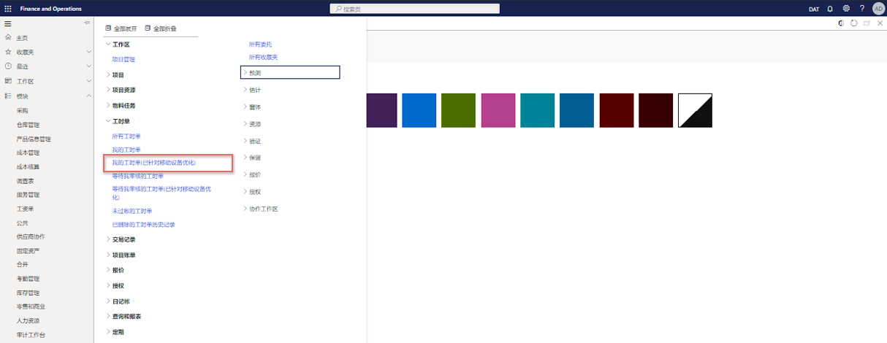

---
demo:
    title: '演示 3： 了解项目成本'
    module: '模块 5： 学习 Microsoft Dynamics 365 Project Operations 的基础知识'
---

## 演示 3 - 了解项目成本

在此演示中，我们将详细介绍将记入 Contoso Consulting 项目的时间和费用条目的创建过程。我们将探索其采用的格式针对 Web 和移动设备演示而进行了优化的条目，并了解如何使用工作流来管理审批过程。

1. 在 **Dynamics 365 for Finance and Operations** 的导航窗格中，选择 **“模块”>“项目管理和会计”>“时间表”>“我的时间表(移动设备优化版)”**。  
    首先，虽然我现在没有使用移动设备，但在选择 **“我的时间表(移动设备优化版)”** 之后，你会发现这些表单可用于移动设备。

      

    此优化是 Microsoft 业务应用程序的一个关键区别，有助于确保最大限度地缩短 Web 和移动设备用户之间的学习曲线。

1. 在右上方的公司选择器中，验证你要连接的法人是否是 **“USSI”**。如果不是，请将法人更改为 **“USSI”**。

1. 在 **“我的时间表”** 页上，选择 **“新建”**。  
    现在，我们将基于配置的设置创建一个新的时间表。

1. 在 **“新建时间表”** 窗格中，点击 **“日期”** 框。  
    输入的日期将确定时间表周期。

1. 点击 **“从收藏夹创建”**。  
    如果你保存了收藏夹，则可以选择从中创建以节省时间。

1. 完成后选择 **“确定”**。

1. 在 **“我的时间表详细信息”** 页上，选择 **“新建 +”** 图标。

1. 在 **“新时间表项”** 窗格中，点击 **“法人”** 框。  
    随即将打开该新时间表项，其中包含客户、项目、类别、项属性和税收参数等详细信息。如果时间条目代表组织中的另一家公司，则也可以选择其他法人。

1. 选择 **“项目 ID”** 菜单。

1. 选择一个可用的项目，例如 **“Contoso Consulting”** 项目。

1. 完成后选择 **“确定”**。  
    随即将打开时间条目的针对移动设备进行了优化的屏幕，你可以开始针对该项目和类别（在本例中为 **“服务”**）预订每天的时间。

1. 在 **“时间条目”** 页面的 **“星期一”** 框中，输入 **8**。  
    这代表一天的小时数条目。

    

1. 在 **“内部评论”** 框中，添加评论。例如： **也许可以和他们谈谈新自行车**。  
    你还可以针对项目输入内部评论和外部评论，以确保各方都了解所记录的时间的性质。

1. 在 **“外部评论”** 框中，添加评论。例如： **调整了链条并对准了车队的前轮**。

1. 在导航栏中，选择 **“保存”**。

1. 在左侧导航菜单的 **“时间表”** 下，选择 **“我的时间表”**。

1. 在 **“我的时间表”** 页面上，选择之前创建的时间条目。

1. 在 **“时间表”** 选项卡上，点击“类别”列。  
    现在假设我们已回到计算机，并且正在从 Web 时间表表单中查看我们的时间。我们仍然可以看到相同的信息，例如类别和时间。

1. 在 **“项详细信息”** 下，点击 **“内部评论”** 和 **“外部评论”**。  
    我们还可以查看我们之前输入的评论。信息都在，但布局格式略有不同。这种格式通常用于最终审阅，因为它让人们可以更轻松地审阅和验证他们的时间，尤其是当某人被分配到多个项目或类别时。

1. 在导航栏中，选择 **“工作流”** 选项卡。  
    如果我们对时间表感到满意，则可以将其提交。所需的批准将由每个组织在实现阶段根据各自的公司策略来决定。

1. 在 **“审阅时间表工作流”** 窗格中，选择 **“提交”**。

1. 在 **“审阅时间表工作流 - 提交”** 窗格中，添加所有其他评论。

1. 选择 **“提交”**。

1. 浏览到 **“时间事务”** 页面。如果 **“时间事务”** 选项卡灰显，请浏览至 **“我的时间表”** 页面，然后选择先前创建的时间表。

1. 在 **“时间事务”** 页面上，查看该页面。  
    批准后，结果将公布，并显示在“时间事务”页面中。我们可以查看所有相关信息，例如法人、项目、类别、时间，在本例中，甚至可以查看成本价和销售价。  

接下来，我们可以深入到凭证交易。

1. 在导航栏中，选择 **“凭证”**。

1. 在 **“凭证交易”** 页面上，点击 **“分类帐帐户”** 和 **“帐户名称”** 部分。  
    在这些部分中，我们可以看到对总分类帐的影响，以及将要使用的帐户。  

现在，让我们针对同一个 Contoso Consulting 项目创建一个费用条目。

1. 在导航窗格中，依次选择 **“模块” > “费用管理” > “我的费用” > “费用报告”**。

1. 在 **“费用管理”** 页面上的 **“报告”** 选项卡中，选择 **“+ 新建费用报告”**。

1. 在 **“新建费用报告”** 窗格中的 **“用途”** 框中，输入标题。例如 **“Contoso – Feb2021”**。

1. 选择 **“确定”**。

1. 在 **“费用”** 页面中，选择 **“+ 新建费用”**。  
此时会显示一个新的费用项。

1. 在 **“费用类别”** 列中，从下拉 **“类别”** 菜单中选择 **“燃料”**。  
我们可以在此处输入新费用及其详细信息。

1. 在 **“交易金额”** 列中，输入 **25.00**。

1. 在 **“货币”** 列中，选择 **“美元”**。

1. 在 **“交易日期”** 列中，选择日期。例如 **“2021 年 2 月 1 日”**。  
    输入所有详细信息后，便可以保存该费用。

1. 选择 **“保存”**。

1. 在左侧导航菜单的 **“工作区”** 下，选择 **“费用管理”**。

1. 在 **“费用管理”** 页面上，选择刚创建的费用报告。

1. 在 **“费用报告”** 页面上，选择 **“项目 ID”** 框，然后选择 **“00000093 Contoso Consulting”**。  

接下来，我们可以指示该燃料将计入 Contoso Consulting 项目，以及有关该费用的其他信息。

1. 点击 **“其他信息”** 框。

1. 在屏幕的右下角，选择 **“保存并继续”**。

1. 在屏幕右侧，选择 **“提交”**。

1. 在 **“评论”** 框中，添加所有其他评论。

1. 选择 **“提交”**。

1. 在 **“费用管理”** 页面上，点击 **“批准状态”** 列。  
    此时，差旅策略和费用批准流程将会激活。费用已过帐并已应用于 Contoso Consulting 项目，如果需要收费，可以稍后开具发票。

在此演示中，我们处理了计入 Contoso Consulting 项目的时间和费用条目。我们看到了 Web 和移动设备格式的示例，并且能够看到如何使用工作流来管理 USSI 组织所需的批准。
