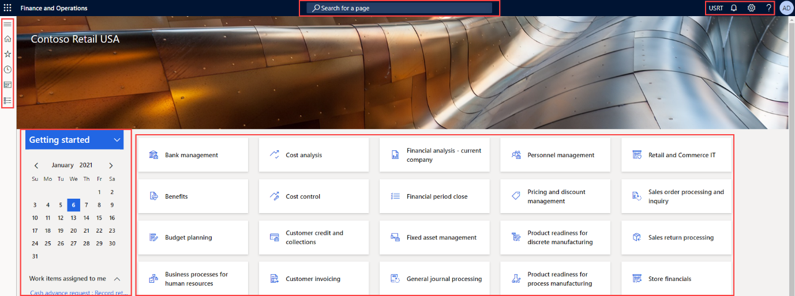

---
lab:
  title: 实验室 1：浏览财务和运营应用
  module: 'Module 1: Explore the core capabilities of Dynamics 365 finance and operations apps'
---

# 模块 1：探索 Dynamics 365 财务和运营应用的核心功能

## 实验室 1：浏览财务和运营应用

## 目标

现在你已经熟悉了财务和运营应用，那么花点时间来了解界面吧。

## 实验室教学设置

- 预计用时：10 分钟

## Instructions

### 登录实验室计算机

1.  使用以下凭据登录实验室计算机：

    - 用户名：`Administrator`

    - 密码：`pass@word1`

1.  等待 AdminUserProvisioning 脚本完成后再继续。 这可能需要 2-3 分钟。 脚本完成后，将短暂显示一个弹出框，用于确认管理员用户已成功更新。 

1.  Microsoft Edge 将打开财务和运营 URL：<https://usnconeboxax1aos.cloud.onebox.dynamics.com>

1.  使用“资源”菜单中提供的“用户名和密码”登录。 

### 浏览财务和运营应用

现在你已经熟悉了财务和运营应用，那么花点时间来了解界面吧。

1.  在财务和运营应用主页上（如果已配置），可找到以下内容：

    - 左侧的导航菜单，默认情况下处于折叠状态。

    - 你公司的徽标。

    - 可以使用的工作区磁贴（具体取决于你在组织中的角色）。

    - 分配给你的日历和工作项。

    - “搜索”栏，对于快速查找所需的内容非常有用。

    - 在右上角，有你当前正在处理的公司、通知、设置和帮助链接。 验证列出的公司是否为“USMF”。

    

2.  在左上角，选择“扩展导航窗格”汉堡菜单。

3.  在导航窗格中，可以找到“收藏夹”、“最近的项目”、“工作区”和“模块”的集合   。

4.  在导航窗格中，选择“模块” > “系统管理”。

5.  查看“系统管理”模块中可用的区域。

6.  在“设置”下，选择“客户端性能选项” 。

7.  在“客户端性能选项”窗格中，选择“启用功能标注”下的切换开关，并确保将其设置为“是”  。

8.  查看其他可用选项，滚动到窗格底部，然后选择“确定”。

9.  在主页的右上角，选择“设置”图标，然后选择“用户选项”  。

    

10. 在“选项”页面上，使用选项卡配置应用于帐户的其他设置。

11. 选择“首选项”选项卡。

12. 查看可用的首选项。 请注意，你可以更改登录时显示的默认公司和初始页面视图。

13. 选择并查看“帐户”和“工作流”选项卡 。

14. 在左侧导航菜单中，选择“主页”图标。

15. 在主页顶部的中心位置，选择“搜索页面”框 。

16. 在搜索框中，搜索“所有供应商”。

17. 选择所有供应商应付账款，然后选择供应商

18. 首次搜索页面时，可能需要等待。 在搜索过程中，搜索框的右侧将显示一个旋转的小圆圈。

19. “所有供应商”页是一个列表页示例。 列表页面包含可读取、创建、删除和更新的主数据。 列表上方的功能区有更多功能。

    

20. 突出显示列表中的一个供应商，在右侧选择“相关信息”菜单，然后查看所提供的其他信息。

21. 在供应商列表中，选择“Acme 办公用品”。

22. 选择“组”菜单，然后选择“供应商组”列标题 。

    

23. 许多菜单都有排序和筛选功能。 使用筛选器可以快速找到要查找的字段内容。

24. 请注意右上角的其他功能。 将鼠标移到每个项，并查看功能标注。 完成后，选择“关闭”图标以关闭页面并返回主页 。

    

25. 在右上角，选择“帮助”问号图标，然后选择“帮助” 。

26. 请注意，帮助信息与当前页面相关。

27. 尝试选择一个工作区磁贴，然后查看该工作区的帮助信息。 完成后，返回主页。

