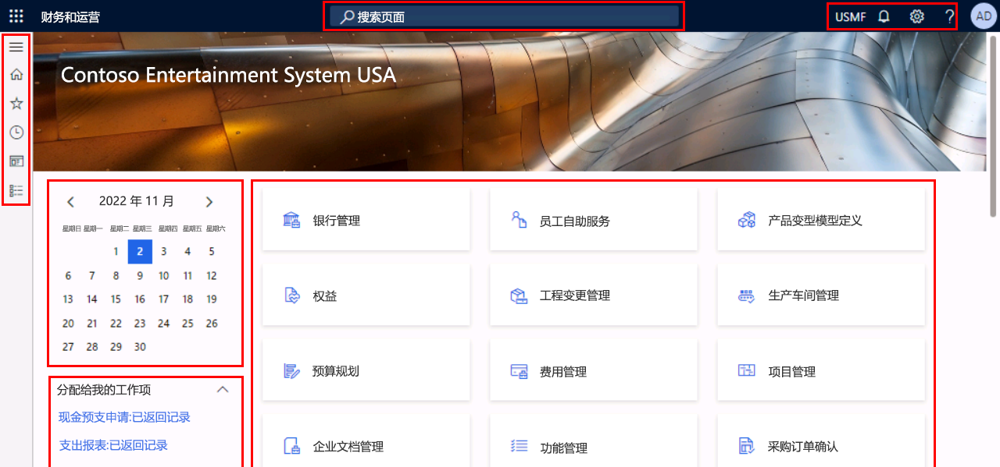
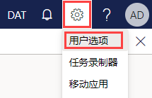
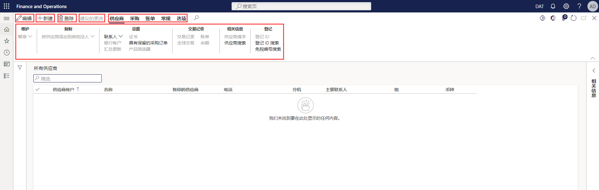

---
lab:
  title: 实验室 1：浏览财务和运营应用
  module: 'Module 1: Explore the core capabilities of Dynamics 365 finance and operations apps'
---

# 模块 1：探索 Dynamics 365 财务和运营应用的核心功能

## 实验室 1：浏览财务和运营应用

## 目标

现在你已经熟悉了财务和运营应用，那么花点时间来了解界面吧。

## 实验室教学设置

- 预计用时：10 分钟

## Instructions

### 登录实验室计算机

1.  使用以下凭据登录实验室计算机：

    - 用户名：`Administrator`

    - 密码：`pass@word1`

1.  等待 AdminUserProvisioning 脚本完成后再继续。 这可能需要 2-3 分钟。 脚本完成后，将短暂显示一个弹出框，用于确认管理员用户已成功更新。 

1.  Microsoft Edge 将打开财务和运营 URL：<https://usnconeboxax1aos.cloud.onebox.dynamics.com>

1.  使用“资源”菜单中提供的“用户名和密码”登录。 

### 浏览财务和运营应用

1.  在 Finance and Operations 主页上，会显示以下内容： 

    - 左侧的导航菜单，默认情况下处于折叠状态。 

    - 公司的默认横幅图像。 

    - 可以使用的工作区磁贴（具体取决于你在组织中的角色）。 

    - 分配给你的日历和工作项。 

    - “搜索页面”栏，对于快速查找所需的内容非常有用。 

    - 在右上角，有你当前正在处理的公司、通知、设置和帮助链接。 

    

1.  验证列出的公司是否为“USMF”。 

1.  在左上角，选择“扩展导航窗格”汉堡菜单。 

1.  在导航窗格中，可以找到“收藏夹”、“最近的项目”、“工作区”和“模块”的集合   。 

1.  在导航窗格中，选择“模块” > “系统管理”。 

1.  查看“系统管理”模块中不同的可用区域 。 

1.  在“设置”下，选择“客户端性能选项” 。 

1.  在“客户端性能选项”窗格中，选择“启用功能标注”下的切换开关，并将其设置为“是”。  

1.  查看其他可用选项，滚动到窗格底部，然后选择“确定”。 

1.  在主页的右上角，选择“设置”图标，然后选择“用户选项” 。 

    

1.  在“用户选项”页上，使用选项卡配置将应用于帐户的其他设置。 

1.  选择“首选项”选项卡。 

1.  查看可用的首选项。 请注意，你可以更改登录时将显示的默认“公司”和“初始网页” 。 

1.  选择并查看“帐户”和“工作流”选项卡 。 

1.  在左侧导航菜单中，选择“主页”图标。 

1.  在主页顶部的中心位置，选择“搜索页面”框。 

1.  在搜索框中，搜索 `All vendors` 

1.  首次搜索页面时，可能需要等待。 在搜索过程中，搜索框的右侧将显示一个旋转的小圆圈。 

1.  选择第一个结果“所有供应商”，这与导航到“模块” > “应付帐款” > “供应商” > “所有供应商”的效果相同    。 

1.  “所有供应商”页是一个列表页示例。 列表页面通常包含可读取、创建、删除和更新的主数据。 通过列表上方的操作窗格，你将看到其他可用的功能。 

    

1.  突出显示列表中的一个供应商，在右侧选择“相关信息”速见表窗格，然后查看所提供的其他信息。 

1.  在供应商列表中，打开“Acme 办公用品”记录。 

1.  在操作窗格中选择“编辑”，然后在“组”字段中选择下拉菜单，然后选择“供应商组”列标题  。 

    

1.  许多菜单都有排序和筛选功能 。 使用筛选器可以快速找到要查找的字段内容。 如果你已经知道该值，只需将其输入到字段中，而无需使用下拉菜单。 

1.  请注意操作窗格右侧的其他功能。 将鼠标悬停在每个项的上方，然后查看功能标注。 

1.  选择“关闭”图标以关闭此记录，并返回到“所有供应商”列表页 。 

    

1.  选择右上角的“?” 问号图标，然后选择“帮助”。 

1.  请注意，“帮助信息”窗格显示当前页的内容。 关闭“帮助”窗格。 

1.  使用左上角的“Finance and Operations”按钮或左侧导航菜单中的“主页”图标返回到默认仪表板  。 

    > 注意：键盘快捷方式：Alt+Shift+Home。 Dynamics 365 Finance and Operations 支持大量键盘快捷方式，以加快访问系统的速度： https://learn.microsoft.com/en-us/dynamics365/fin-ops-core/fin-ops/get-started/shortcut-keys

1.  尝试选择一个工作区磁贴，然后查看该工作区的帮助信息。 完成后，返回到默认仪表板。 

