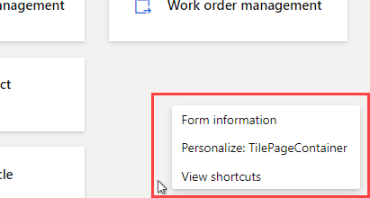
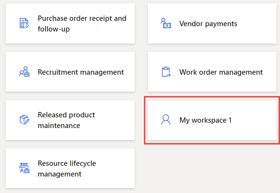
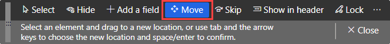
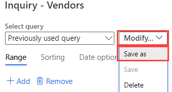

---
lab:
  title: 实验室 2：探索工作区和筛选
  module: 'Module 1: Learn the Fundamentals of Microsoft Dynamics 365 Supply Chain Management'
ms.openlocfilehash: 0a2815e312b9798dcf93ec6cee669eb65a1f9942
ms.sourcegitcommit: 252458fca8e71b6e5e8b99ae4c2b47cd85461a30
ms.translationtype: HT
ms.contentlocale: zh-CN
ms.lasthandoff: 01/27/2022
ms.locfileid: "137909347"
---
# 模块 1：学习 Microsoft Dynamics 365 Supply Chain Management 的基础知识

## 实验室 2 - 探索工作区和筛选功能

## 目标

当你首次登录财务和运营时，可以使用许多内置工作区。 此外，还可以创建自己的工作区，其中的内容侧重于你可能需要的内容。 工作区是 Dynamics 365 的众多功能之一，但你也应该知道，筛选才是真正可获取要查找的特定项的方法。 你必须创建新的个性化工作区，并使用筛选功能来识别所需的不同项。

## 实验室教学设置

   - 预计用时：10 分钟

## Instructions

1. 在财务和运营主页上的“工作区”磁贴右侧，右键单击或点击并按住空白区域以触发菜单。

    

1. 在菜单中，选择“个性化设置:TilePageContainer”。

1. 在“个性化设置”窗口中，选择“+ 添加工作区”。

1. 如果未显示小型的“个性化设置”窗口，请尝试在主页上向上滚动，右键单击或点击并按住，然后再次选择“个性化设置:TilePageContainer”。

    

1. 在主页上，向下滚动并找到新的“我的工作区 1”磁贴。

    

1. 右键单击或点击并按住该磁贴，然后选择“个性化设置:我的工作区 1”。

1. 在“个性化设置”窗口中，将“我的工作区 1”重命名为“我的工作区”，然后选择“对此页面进行个性化设置” 。  
    名称更改将自动保存。

1. 在新打开的工具栏中，选择“移动”。

    

1. 选择“我的工作区”磁贴，然后将其移动到主页上的其他位置。

    >[!Note] 如果无法移动磁贴，请刷新页面，然后重试前面的步骤以移动磁贴。

1. 关闭工具栏。

1. 在主页上的“搜索页面”框中，搜索并选择“所有供应商” 。

1. 在“所有供应商”页面上的顶部菜单中，选择“选项” > “添加到工作区”。

1. 在“工作区”筛选器框中，输入“我的工作区”，然后选择该工作区 。

1. 选择“演示文稿”菜单，查看可用选项，然后选择“磁贴”。

1. 完成后，选择“配置”。

1. 在“添加为磁贴”窗格中，验证磁贴名称，然后选择“确定”。

1. 在左侧导航窗格中，选择“主页”图标。

1. 在主页上，选择新的工作区。

1. 在“我的工作区”页面上，验证是否显示了新添加的“供应商”磁贴。

1. 选择“供应商”磁贴。

1. 在“所有供应商”页面上的“筛选器”框中，输入 Contoso 。

1. 查看可用于查找 Contoso 的不同字段。

    

1. 选择“名称:‘Contoso’”，然后验证筛选结果。

1. 清除筛选器框，然后按 Enter 以显示所有供应商。

1. 选择列标题“组”。

    

1. 你可以使用此筛选器按最低到最高（按 A 到 Z 排序）或最高到最低（按 Z 到 A 排序）对组进行排序。

1. 在“组”下，选择“开头”菜单，然后查看比较运算符 。 选择“是否正确”。

1. 选择“是否正确”下面的菜单，然后选择“其他供应商” 。  
    或者，你可以在菜单字段中输入一个值。

1. 选择“应用”，然后查看结果。 请注意“组”列标题中的筛选器图标。

    

1. 选择“组”列，然后在筛选器菜单中选择“清除” 。

1. 在“所有供应商”标题的左侧，选择“筛选器”图标。

    

1. 在“筛选器”窗格的右上角，选择“+ 添加”。

1. 在“添加筛选器字段”窗格中，选中“组”左侧的复选框，然后选择“更新”。

1. 请注意已添加的其他筛选器。 这将使你可以基于多个条件来筛选列表。

    

1. 在“供应商帐户开头”筛选器中，选择菜单，然后选择“Northwind Traders” 。

1. 在“组开头”筛选器中，选择菜单，然后选择“30” 。

1. 选择“应用”，然后查看筛选结果。

1. 在“筛选器”窗格中，选择“重置”，注意其他筛选器已删除，默认筛选器已重置为空值。

1. 在功能区栏上，选择“选项”，然后在“页面选项”部分中，选择“高级筛选器或排序” 。

    

1. 在“查询 - 供应商”窗口中，选择“+ 添加”。

1. 在新行的“字段”单元格中，选择菜单，然后选择“组”。

1. 或者，你可以选择菜单，开始输入组的名称，然后从筛选器的结果中选择它。

1. 在“条件”单元格中，选择“打开”图标。

    

1. 在“供应商组”列表中，选择“30 个其他供应商”。

1. 要保存新查询，请在“选择查询”下，选择“修改”菜单，然后选择“另存为”  。

    

1. 在“保存查询”窗格中的“名称”框中，输入“我的查询”，然后选择“确定” 。

1. 在“查询 - 供应商”页面上，选择“确定”。

1. 验证列表是否反映了新创建的查询的结果。

1. 要删除筛选器，请选择“高级筛选器或排序”，再在“查询 - 供应商”页面上，选择“重置”，然后选择“确定”  。

1. 这将重置查询，但不会删除已保存的查询。
