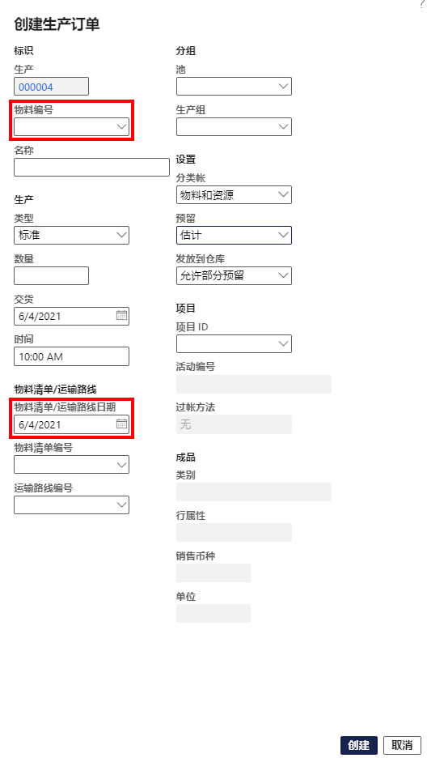

---
lab:
    title: '实验室 6：创建生产订单'
    module: '模块 1：学习 Microsoft Dynamics 365 Supply Chain Management 的基础知识'
---

## 实验室 6 - 创建生产订单

## 目标

生产订单包含有关生产的物品、生产的数量和计划的完成日期的信息。它还包含了有关生产物品要消耗的材料和要遵循的流程的信息。

你需要为你的公司创建一个新的生产订单。

## 实验室设置

   - **预计用时**： 5 分钟

## 说明

1. 在财务和运营主页的右上角，验证你当前是否在对 USMF 公司执行操作。

1. 如有必要，请选择公司，然后从菜单中选择 **“USMF”**。

1. 在左侧的导航窗格中，选择 **“模块”** > **“生产控制”** > **“生产订单”** > **“所有生产订单”**。

1. 在顶部菜单中，选择 **“新建生产订单”**。

1. 在 **“标识”** 下的 **“物料编号”** 框中，输入 **“D0001”**，然后选择已标识的物料。

1. 在 **“生产”** 下的 **“交货”** 框中，选择从当前日期开始再过一个月的日期。  
    交货日期表示为了按时交货，生产订单应在何时结束。该日期可用于计划过程。例如，可以将订单安排在交货日期前。

1. 在 **“数量”** 框中，输入 **“20”**。

1. 在 **“物料清单/工艺路线”** 下，“物料清单编号”字段会自动显示当前物料的任何有效物料清单的编号，但通过从批准的物料清单版本列表中选择一个有效物料清单可更改生产订单的物料清单。“工艺路线编号”字段会自动显示当前物料的任何有效工艺路线的编号，但通过从批准的工艺路线版本列表中选择一个有效工艺路线可更改生产订单的工艺路线。

    

1. 选择 **“创建”**。
