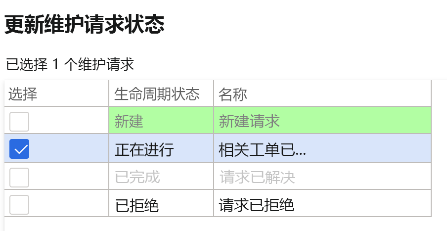
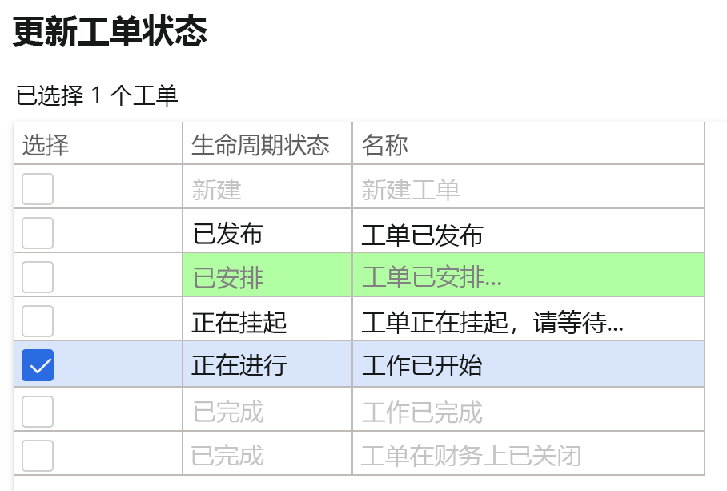
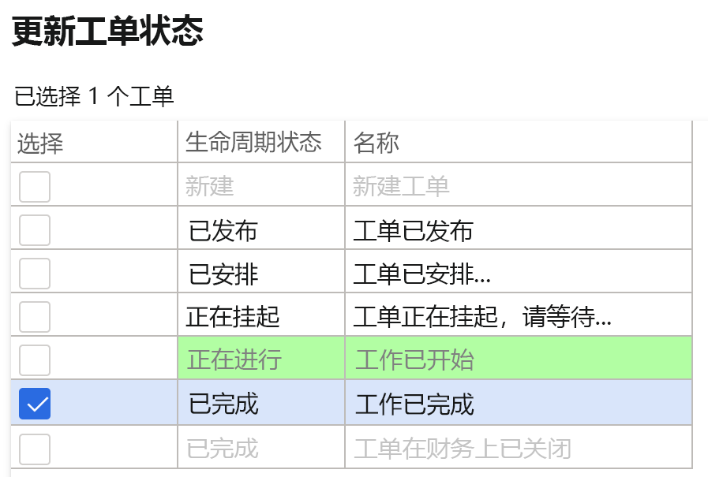

---
lab:
    title: '实验室 7：创建维护工作订单'
    module: '模块 1：学习 Microsoft Dynamics 365 Supply Chain Management 的基础知识'
---

## 实验室 7 - 创建维护工作订单

**目标**

系统中的维护订单描述了资产所需的维护或修理，用于分配合适的资源来完成维护请求。工作订单是基于维护订单创建的，由分配的资源执行。

**实验室设置**

预计用时：15 分钟。

**说明**

1. 在 Finance and Operations 主页的右上角，验证你当前是否在对 USMF 公司执行操作。

2. 如有必要，请选择公司，然后从菜单中选择 **“USMF”**。

3. 在左侧导航窗格中，选择 **“模块”** **&gt;“资产管理”&gt;“设置”&gt;“维护请求”&gt;“生命周期状态”**。

4. 选择“进行中”，并单击操作窗格中的 **“编辑”** 按钮。

5. 在 **“常规”** 选项卡下，将 **“创建工作订单”** 值更改为“是”。

6. 在左侧导航窗格中，选择 **“模块”** **&gt;“资产管理”&gt;“工作区”&gt;“维护请求管理”**。

7. 单击 **“创建维护请求”**。

8. 在对话框的字段中输入以下值，然后单击 **“确定”** 按钮。

	- 维护请求类型：纠正

	- 说明：金属探测器噪音

	- 功能位置： PP-02-02

	- 资产： MD-201

	- 服务级别：4

	- 故障现象：噪音过大

	- 故障区域：电气 

9. 关闭 **“维护请求”** 表单，并返回到 **“维护请求管理”** 工作区。

10. 按屏幕右上角的 **“刷新”** 图标，刷新页面。

11. 新的维护请求将显示在没有工作订单的维护请求列表中。

12. 选择新建的维护请求，并单击 **“更新维护请求状态”** 按钮。 

13. 在对话框中选中“进行中”旁边的复选框，然后单击 **“确定”**

 

14. 选择新建的维护请求，并单击 **“创建工作订单”** 按钮。 

15. 在对话框的字段中输入以下值，然后单击 **“确定”** 按钮。

	- 维护作业类型：检查

16. 将创建新的工作订单，并且该工作订单将在所选的维护请求记录中进行更新。

17. 单击工作订单并导航到 **“工作订单详细信息”** 屏幕。

18. 在工作订单行下，单击 **“分派”** 按钮。

19. 在对话框的字段中输入以下值，然后单击 **“确定”** 按钮。

	- 工作人员：Ted Howard

20. 在“操作”菜单中，导航至 **“工作订单”&gt;“生命周期状态”&gt;“更新工作订单状态”**。

21. 在对话框中选中“进行中”旁边的复选框，然后单击 **“确定”**

22. 在对话框中选择 **“实际开始”** 日期和时间，然后单击 **“确定”**。

23. 在工作订单“操作”菜单中，再次导航至 **“工作订单”&gt;“生命周期状态”&gt;“更新工作订单状态”**。

24. 在对话框中选中“已完成”旁边的复选框，然后单击 **“确定”**

25. 在“实际结束”字段中选择一个大于开始日期和时间的日期和时间，然后单击 **“确定”**

26. 你将在已完成的工作订单标题中找到当前的生命周期状态。
