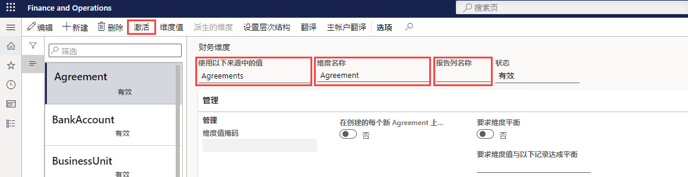

---
lab:
  title: 实验室 1：创建财务维度
  module: 'Module 2: Learn the Fundamentals of Microsoft Dynamics 365 Finance'
ms.openlocfilehash: 9bbc1a92cb719b988ddfa6a08e1e3b2d8c69976e
ms.sourcegitcommit: 252458fca8e71b6e5e8b99ae4c2b47cd85461a30
ms.translationtype: HT
ms.contentlocale: zh-CN
ms.lasthandoff: 01/27/2022
ms.locfileid: "137909582"
---
## 实验室 1 - 创建财务维度

## 目标

使用财务维度页面创建可用作会计科目表中的科目段的财务维度。 财务维度有两种类型：自定义维度和实体支持的维度。 自定义维度可在法人之间共享，这些值由用户输入和维护。 对于实体支持的维度，这些值在系统中的其他位置进行定义，例如在客户或商店实体中。 一些实体支持的维度可在法人之间共享，而其他实体支持的维度是公司特定的。

你必须创建一个可供公司使用的自定义财务维度。

## 实验室教学设置

   - 预计用时：5 分钟

## Instructions

1. 在 Finance and Operations 主页的右上角，验证你当前是否在对 USMF 公司执行操作。

1. 如有必要，请选择公司，然后从菜单中选择“USMF”。

1. 在左侧导航窗格中，选择“模块” > “总帐” > “会计科目表” > “维度” > “财务维度”。    

1. 在顶部菜单中，选择“+ 新建”。

1. 在“财务维度页面”中，选择“使用以下来源的值”菜单，然后选择“<自定义维度>” 。

1. 在“维度名称”框中，输入“Affliate_Revenue” 。

1. 在“报表列名称”框中，输入“Afflt” 。

1. 在顶部菜单中，选择“激活”。

    

1. 查看对话框中的信息，然后选择“关闭”。

1. 查看警告通知横幅。

    

    >[!NOTE] 可在沙盒和生产环境中通过 Lifecycle Services (LCS) 直接开启和关闭维护模式。 有关管理生命周期服务的详细信息，请参阅 [https://docs.microsoft.com/en-us/dynamics365/fin-ops-core/dev-itpro/deployment/maintenanceoperationsguide-newinfrastructure](https://docs.microsoft.com/en-us/dynamics365/fin-ops-core/dev-itpro/deployment/maintenanceoperationsguide-newinfrastructure)。
