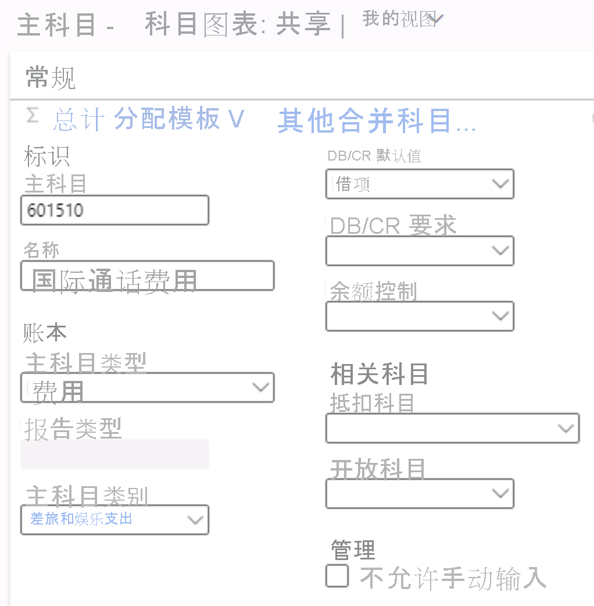

---
lab:
  title: 实验室 1：创建主帐户
  module: 'Module 2: Learn the Fundamentals of Microsoft Dynamics 365 Finance'
---

# 模块 2：学习 Microsoft Dynamics 365 Finance 的基础知识

## 实验室 1：创建主帐户

## 实验室教学设置

   - 预计用时：5 分钟

## Instructions

1.  在 Finance and Operations 主页的右上角，验证你当前是否在对 USMF 公司执行操作 。 

2.  如有必要，请选择公司选取器，然后选择“USMF”。 

3.  在左侧导航窗格中，在“总帐”模块中选择“会计科目表” > “科目” > “主科目”   。

4.  在操作窗格中选择“+ 新建”。

5.  在“主科目”页输入以下值： 

    - 主科目：`601510`

    - 名称：`International call expense`

    - 主科目类型：`Expense`

    - 主科目类别：`TANDEEXP`

    - DB/CR 默认值：`Debit`

    

6.  选择“保存”并关闭页面 。 

