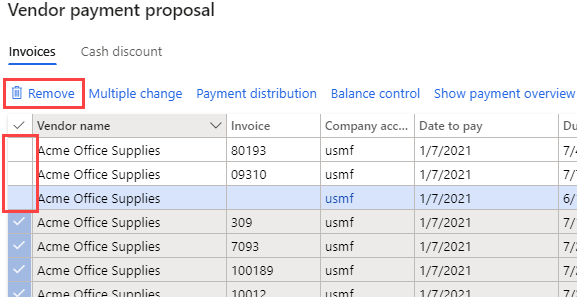

---
lab:
  title: 实验室 2：创建供应商付款日记帐
  module: 'Module 2: Learn the Fundamentals of Microsoft Dynamics 365 Finance'
ms.openlocfilehash: cc38bf9c77d8b5d45e8a27f0a8f766d7834e065a
ms.sourcegitcommit: 252458fca8e71b6e5e8b99ae4c2b47cd85461a30
ms.translationtype: HT
ms.contentlocale: zh-CN
ms.lasthandoff: 01/27/2022
ms.locfileid: "137909612"
---
## 实验室 2 - 创建供应商付款日记帐

## 目标

按定期计划向供应商付款的组织现在可以自动执行生成供应商付款提议的过程。 供应商付款提议自动化可定义以下详细信息：

- 在什么情况下执行付款提议
- 使用什么条件来选择应支付的发票
- 将产生的付款保存在哪个供应商付款日记帐中

付款提议自动化不会自动过帐付款。 因此，你可以继续使用当前用于批准所创建的付款的任何验证和工作流过程。

创建新的供应商付款日记帐分录和付款提议。

## 实验室教学设置

   - 预计用时：10 分钟

## Instructions

1. 在 Finance and Operations 主页的右上角，验证你当前是否在对 USMF 公司执行操作。

1. 如有必要，请选择公司，然后从菜单中选择“USMF”。

1. 在左侧导航窗格中，选择“模块” > “应付帐款” > “付款” > “供应商付款日记帐”。   

1. 在顶部菜单中，选择“+ 新建”。

1. 请记下已创建的新的日记帐批处理号。

1. 在“名称”框中，输入“供应商”，然后从筛选的列表中选择“VendPay”  。

1. 在顶部菜单中，选择“行”。

1. 在“供应商付款”页面的顶部菜单上，选择“付款提议” > “创建付款提议” 。  
    付款提议是用于选择进行付款的发票的查询。 在创建或生成供应商付款之前，可编辑要支付的发票列表。

    

1. 在“供应商付款提议”窗格的“发票选择条件”下，选择“发票选择依据”菜单，查看可用选项，然后选择“到期日期”  。

1. 在“开始日期”和“结束日期”中，删除所有现有值 。 在本练习中，这些日期范围将留空。

    >[!NOTE] 可能会将最小付款日期用作付款日期。 最小付款日期将是创建付款时使用的最早日期。 例如，如果发票的到期日期晚于最小付款日期，则到期日期将替代最小付款日期作为付款日期，以在可能的最晚日期支付发票。

1. 展开“要包含的记录”，然后查看选项。  
    此筛选器通常用于限制供应商组选择用于付款的发票或付款方式。 例如，可添加一个筛选器，以在此付薪周期内仅用支票对发票付款。

1. 展开“高级参数”，然后查看可用选项。  
    其他参数可用于定义付款币种或支持在此付薪周期进行集中付款。

1. 选择“确定”。  
    选择“确定”后，将显示查询结果。 如果不需要预览选择用于付款的发票列表，则可返回“参数”快速选项卡并将“在不预览发票的情况下创建付款”设置更改为“是” 。

1. 在“供应商付款提议”窗口中，选择“显示付款概览”，以查看将为供应商针对所选发票创建的付款。

    

1. 在菜单上，选择“隐藏付款概览”以隐藏付款。

1. 选择“供应商名称”列标题左侧的复选标记图标，以选择所有发票。

    

1. 清除前三张发票的复选框，然后在菜单上选择“删除”，以删除所有其他发票。

    

1. 在对话框中，选择“是”。

1. 查看剩下的三张发票。

1. 若要将发票列表导出到 Excel，请右键单击网格并选择导出选项。

1. 在右下角，选择“创建付款”，以在付款日记帐中创建供应商付款。

1. 查看供应商付款列表。
