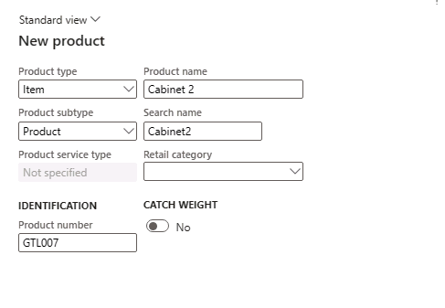

---
lab:
  title: 实验室 1：创建新产品
  module: 'Module 3: Learn the Fundamentals of Microsoft Dynamics 365 Supply Chain Management'
---

# 模块 3：学习 Microsoft Dynamics 365 Supply Chain Management 的基础知识

## 实验室 1：创建新产品

## 目标

在 Contoso Entertainment System USA (USMF)，您计划从供应商处购买新的机柜配置。 您需要创建一个物料来表示新配置。 在此实验室中，你将了解如何创建新的项和项配置。

## 实验室教学设置

   - 预计用时：10 分钟

## Instructions

在 Contoso Entertainment System USA (USMF) 中，你计划从一家供应商处购买一份新的陈列柜配置。 您需要创建一个物料来表示新配置。

1.  在财务和运营应用主页的右上角，验证你当前是否在对 USMF 公司执行操作。 如有必要，请在公司下拉菜单中选择“USMF”。

2.  在左上角，选择“扩展导航窗格”汉堡菜单。

3.  在导航窗格中，选择“模块”，然后选择“产品信息管理”********。 然后在“产品”菜单中选择“产品” 。

4.  在“产品”页顶部菜单中选择“+ 新建” 。

5.  在“新建产品”页面的“产品类型”字段中，检查是否选择了“物料”  。

6.  在 “产品子类型”字段中，检查是否选择了“产品” 。

7.  在“标识”下的“产品编号”框中输入“GTL007”  。

8.  在“产品名称”框中，输入“2 号柜”。

    

9.  选择“确定”按钮。

10. 在“操作窗格”的“产品”菜单下，选择“设置”组下的“维度组”  。

    

11. 选择“存储维度组”下拉菜单，并选择“SiteWH” 。

12. 选择“跟踪维度组”下拉菜单，并选择“无” 。

13. 选择“确定”  按钮。

14. 选择操作窗格中的“发布产品”按钮以在法人中发布产品。

15. 此时会打开一个页面，其中第一步显示为“选择要发布的产品”。

    

16. 选择该页面底部的“下一步”按钮

17. 在“选择要将产品发布到的公司”页中，选择要在其中发布产品的 USMF 法人 。

18. 选择该页面底部的“下一步”按钮。

19. 在“确认选择”页面中，将“在失败时显示信息日志”的值设置为“是”，并将“按批运行”设置为“否”    。

20. 选择页面底部的“完成”按钮。

21. 在导航窗格中，选择“模块”，然后选择“产品信息管理”。 然后在“产品”菜单中，选择“已发布的产品”。

22. 在“已发布产品”******** 页的网格中找到新项目“GTL007”****。 

23. 选择产品链接并导航到“产品详细信息”页。

24. 在“常规”快速选项卡中输入以下信息：

    - 物料模型组：FIFO

25. 在“购买”快速选项卡找那个中输入以下信息：

    - 单位：ea

    - 物料销售税组：全部

    - 价格：30

26. 在“销售”快速选项卡中输入以下信息：

    - 单位：ea

    - 物料销售税组：全部

    - 价格：35

27. 在“管理库存”快速选项卡中输入以下信息：

    - 单位：ea

28. 在“工程”快速选项卡中输入以下信息：

    - BOM 单位：ea

29. 在“管理成本”快速选项卡中输入以下信息：

    - 物料组：音频

30. 要完成配置，请在操作窗格中选择“产品”。 选择“维护”组下的“验证”按钮

    

31. 核实你所看到的信息横幅，确认所有需要的字段值都得到了验证。

    

32. 关闭所有页面并返回主页。
