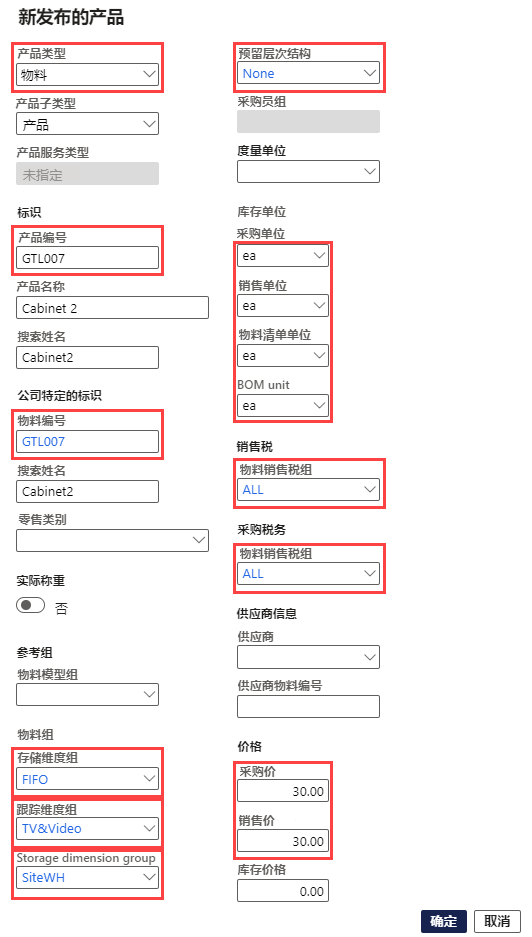
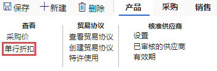
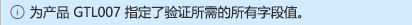

---
lab:
  title: 实验室 1：创建具有各种尺寸和颜色的产品
  module: 'Module 3: Learn the Fundamentals of Microsoft Dynamics 365 Supply Chain Management'
ms.openlocfilehash: 5e32371aea8a73c04c6aee60953ff9c344b3a533
ms.sourcegitcommit: 8e5a278c6e08abdcc3fb719796f79842e868606b
ms.translationtype: HT
ms.contentlocale: zh-CN
ms.lasthandoff: 07/14/2022
ms.locfileid: "147116258"
---
# 模块 1：学习 Microsoft Dynamics 365 Supply Chain Management 的基础知识

## 实验室 1 - 创建新产品

## 目标

在 Contoso Entertainment System USA (USMF) 中，你需要为要从供应商处购买的机柜的新配置创建一个新项目。

## 实验室教学设置

   - 预计用时：10 分钟

## Instructions

1. 在 Finance and Operations 主页的右上角，验证你当前是否在对 USMF 公司执行操作。

1. 如有必要，请选择公司，然后从菜单中选择“USMF”。

1. 在左上角，选择“扩展导航窗格”汉堡菜单。

1. 在导航窗格中，选择“模块” > “产品信息管理”，然后在“产品”类别下，选择“发布的产品”。   

1. 在“已发布产品详细信息”页的顶部菜单中，选择“+ 新建”。

1. 在“新发布的产品”窗格的“产品类型”菜单中，验证是否选择了“物料”。 

1. 在“产品子类型”菜单中，验证是否选择了“产品”。 

1. 选择“跟踪维度组”菜单，然后选择“无”。 

1. 在“标识”下，在“产品编号”和“物料编号”框中，输入“GTL007”。   

1. 在“产品名称”框中，输入“2 号柜”。 

1. 在“参考组”下，选择“物料模型组”菜单，然后选择“先进先出”。  

1. 选择“物料组”菜单，然后选择“电视和视频”。 

1. 选择“存储维度组”菜单，然后选择“SiteWH”。 

1. 在“度量单位”下，验证是否已设置以下值：

    | **设置**| **值**|
    | :--- | :--- |
    | 库存单位| 各一个|
    | 购买单位| 各一个|
    | 销售单位| 各一个|
    | 物料清单单位| 各一个|

1. 在“销售税”下，选择“销售税(物料)组”菜单，然后选择“全部”。  

1. 在“采购税务”下，选择“销售税(物料)组”菜单，然后选择“全部”。  

1. 在“价格”下的“采购价”框中，输入“30.00”。

1. 在“销售价”框中，输入“30.00”。

1. 新发布产品应如下所示：

    

1. 选择“确定”。

1. 为了确保产品已敲定，在功能区栏的“维护”下，选择“验证” 。

    

1. 核实你所看到的信息横幅，确认所有必填字段值都得到了验证。

    

1. 关闭所有页面并返回主页。
