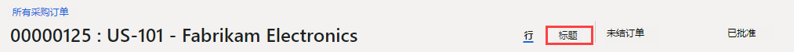
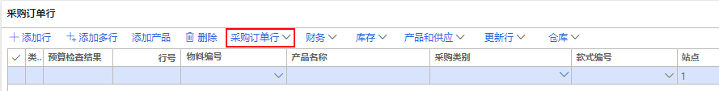

---
lab:
  title: 实验室 2：创建采购订单
  module: 'Module 3: Learn the Fundamentals of Microsoft Dynamics 365 Supply Chain Management'
---

# 模块 3：学习 Microsoft Dynamics 365 Supply Chain Management 的基础知识

## 实验室 2 - 创建采购订单

## 目标

It's more typical for purchase orders to be created automatically as result of master planning, direct delivery, and other processes. When created manually, a purchase order is usually created by a purchasing agent. Create a purchase order using the the USMF company.

## 实验室教学设置

   - 预计用时：10 分钟

## Instructions

1. 在 Finance and Operations 主页的右上角，验证你当前是否在对 USMF 公司执行操作。

1. 如有必要，请选择公司，然后从菜单中选择“USMF”。

1. 在左上角，选择“扩展导航窗格”汉堡菜单。

1. 选择“模块” > “采购” > “采购订单” > “所有采购订单”   。

1. 在“所有采购订单”页的顶部菜单中，选择“+ 新建”。

1. 在“创建采购订单”窗格中，选择“供应商帐户”菜单，然后选择“US-101” 。

1. When you select a vendor, details from the vendor record, such as address, invoice account, delivery terms, and delivery mode, will be copied as default values into the order header. You can change these values at any time.

1. 展开“常规”部分。

1. 在“存储维度”下，选择“场地”菜单，然后查看场地列表 。

1. The Site field, together with the Warehouse field, specifies where the procured goods or services must be delivered. The default delivery address is the site. Both fields can be populated with values set up for the selected vendor, or you can specify them manually.

1. 在“日期”下，“交货日期”字段用于指定何时需要交付采购的货物和服务。

1. You can specify a single delivery date for the order, or the individual order lines can be given unique delivery dates. If the delivery date specified here cannot be met for specific products or services because they have longer lead times, then those lines will be created with a later delivery date to accommodate for this.

1. Expand the <bpt id="p1">**</bpt>Administration<ept id="p1">**</ept> section. The <bpt id="p1">**</bpt>Orderer<ept id="p1">**</ept> box can be used to specify who is placing the order.

1. 由于采用主计划、直接交付和其他流程，自动创建采购订单更为典型。

1. 选择“确定”。

1. 手动创建时，采购订单通常由采购代理创建。

    

1. 在“采购订单行”下的菜单中，选择“采购订单行” 。

    

1. 在“显示”下，选择“维度” 。

1. 使用 USMF 公司创建一个采购订单。

1. 在“维度显示”窗格中，在“产品维度”下，选择“颜色”复选框 。

1. 可选：如果选择了“保存设置”切换开关，在下次打开采购订单页面时，订单行网格上也会显示你所选择的维度。

1. 选择“确定”。

1. 选择“物料编号”单元格菜单，然后选择“T0004” 。

1. 记住，你也可以在筛选器框中输入信息，而不是滚动浏览列表。

1. 通过指定物料编号为产品和服务创建订单行，或通过指定采购类别将订单行创建为支出。

1. Procurement category is used for adding lines where procured items are expensed directly, rather than going into inventory. This means that if you need to expense a purchase, you can do this by creating a purchase order line that specifies a procurement category, rather than creating a line with an item number. Items can also be associated with a procurement category and in this case, the procurement category is shown as informational only.

1. 选择“颜色”菜单，查看可用选项，然后选择其中一种颜色或颜色组合。

1. “场地”和“仓库”通常使用订单头中的值来填充，但如果某些行需要交付到不同的地点，也可以覆盖这些字段。

1. 在“数量”框中，输入“10” 。

1. 如果设置了数量，“数量”中会自动填入该产品的最小订货量，或者自动填入值 1。

1. 部分其他信息：

    - <bpt id="p1">**</bpt>Unit<ept id="p1">**</ept>: Indicates the unit of measure for the ordered quantity. Normally, the unit is automatically provided from the purchasing unit on the product master data.

    - <bpt id="p1">**</bpt>Unit price<ept id="p1">**</ept>: Contains a value from either a purchase agreement or a trade agreement. It is possible to change the unit price on individual order lines—for example, if a unique price is negotiated with the vendor.

    - <bpt id="p1">**</bpt>Discount<ept id="p1">**</ept>: Represents a discount amount per unit. This discount therefore reduces the unit price by the discount. This discount is commonly supplied automatically from purchase agreements or trade agreements, but it is possible to override on individual lines if unique discounts have been negotiated with the vendor.

    - <bpt id="p1">**</bpt>Discount percentage<ept id="p1">**</ept>: When entered, this reduces the net amount for the line accordingly. The discount percent is often supplied automatically from purchase agreements or trade agreements, but it is possible to override on individual lines if a unique discount percentage has been negotiated with the vendor.

    - <bpt id="p1">**</bpt>Net amount<ept id="p1">**</ept>: Calculated from other fields on the line, including quantity, unit price, discount, and discount percent. It is possible to change the Net amount, but then the Unit Price, Discount, and Discount percent fields will be blank, and when you post toward the line, the amount posted will be proportional to the net amount. Generally, the Net Amount field is only used for displaying the net amount of the line.

1. 在“采购订单行”下的页面底部，选择“行明细”。

1. 选择“交货”选项卡。

1. A unique delivery date can be assigned to each order line. The date is inherited from the field on the purchase order header, but you can change this.

1. 关闭“采购订单行”页面。

1. 在“所有采购订单”页面，使用过滤器功能找到新的采购订单。

1. 完成后，关闭“所有采购订单”页面并返回主页。
