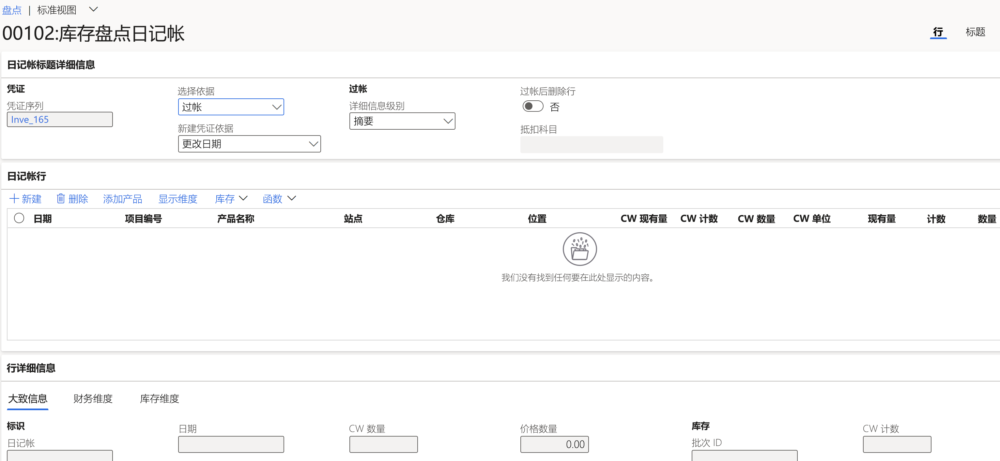

---
lab:
  title: 实验室 3：创建盘点日记帐
  module: 'Module 3: Learn the Fundamentals of Microsoft Dynamics 365 Supply Chain Management'
---

# 模块 3：学习 Microsoft Dynamics 365 Supply Chain Management 的基础知识

## 实验室 3：创建盘点日记帐

## 实验室教学设置

   - 预计用时：10 分钟

## Instructions

1.  在 Finance and Operations 主页的右上角，验证你当前是否在对 USMF 公司执行操作 。 如有必要，请选择公司，然后从下拉列表中选择“USMF”。 

2.  在左侧导航窗格中，在“库存管理”模块中选择“日记帐分录” > “物料盘点” > “盘点”   。 

3.  在操作窗格中选择“+ 新建”按钮。 随即会显示“创建库存日记帐”对话框窗格。 选择“确定”按钮。 

4.  “库存盘点日记帐”窗体将显示标题和行信息。 

    

5.  在操作窗格中，选择“创建行”-&gt;“现有”。 

6.  在“创建现有量盘点日记帐”对话框窗格中，将“仓库”、“库存状态”、“位置”和“牌照”字段设置为“是”     。 

    

7.  展开“要包含的记录”部分并选择“筛选”按钮 。 对于“物料编号”字段，在“条件”字段中输入 `A0001`，然后选择“确定”  。 

8.  在“创建现有量盘点日记帐”对话框窗格底部选择“确定” 。 

    物料 A0001 的现有量将显示在“日记帐行”网格中，其中分拆了场地、仓库和位置 。 

9.  在“日记帐行”部分的“已盘点”列中，匹配为每个场地/仓库和位置盘点的数字 。 注意以下事项： 

    - 如果“现有”量与“盘点”量相同，则“数量”字段将为空。 

    - 如果“盘点”字段的值大于“现有”字段，则“数量”字段将包含正值。 

    - 如果“盘点”字段的值小于“现有”字段，则“数量”字段将包含负值。 

10. 将每行的“日期”字段的年份更改为 2022。 

11. 在操作窗格中选择“验证”按钮，然后在对话框窗格中选择“确定” 。 

12. 选择“发布”按钮。 

13. 关闭该页面并返回到主页。 

